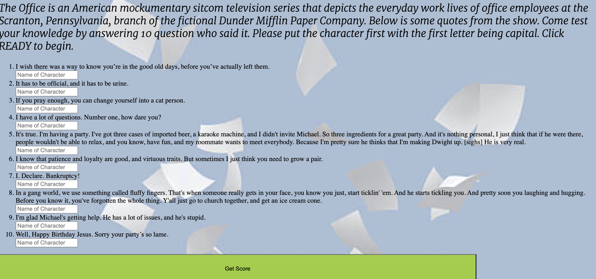
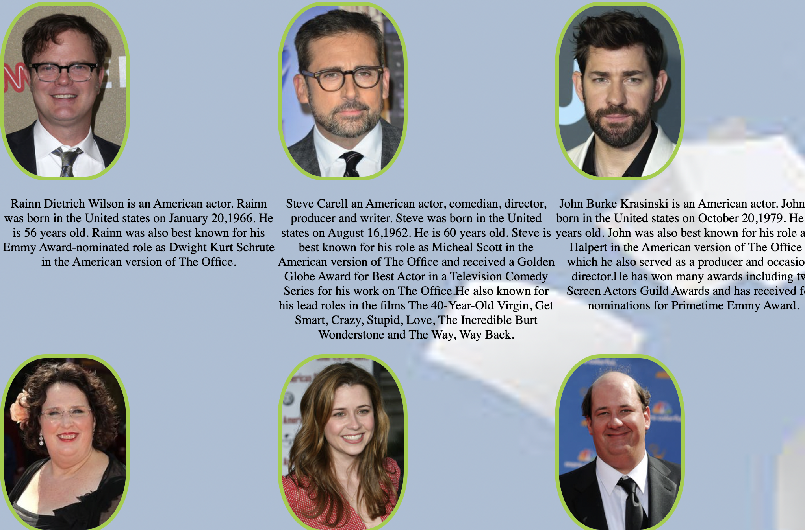

# Front-end Portfolio Project

## Natasha Riddick

- Users will read instructions and click the Ready button.

- User will write the first name of the character that said the Given Quotes.

- After submitting your answers, user will recieve a score and the option to Try Again or Meet the Cast.

- User will be able to hover over the picture to see different a different picture of the cast as they character.

### Api used!

- https://www.officeapi.dev/api/quotes/
- https://api.tvmaze.com/shows/526/cast

## Enjoy!